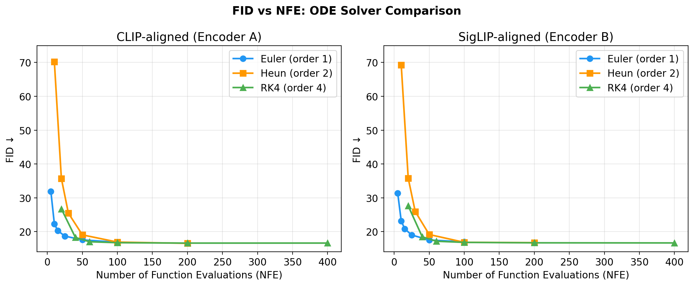
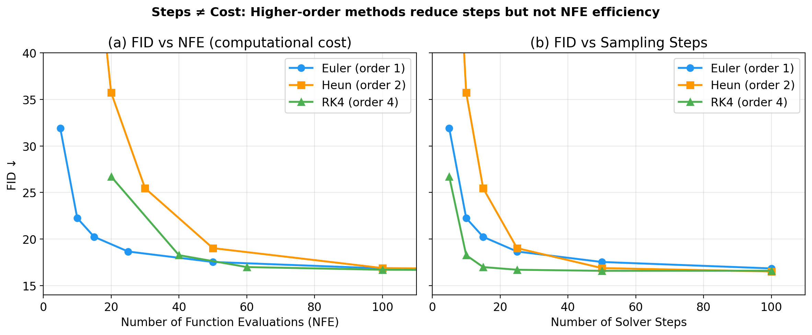

# Numerical ODE Solvers for Rectified Flow Diffusion Transformers

SciML course project. Implements and benchmarks four numerical ODE solvers (Euler, Heun, RK4, adaptive RK45) for sampling from Diffusion Transformers trained with REPA on CIFAR-10.

## Overview

Rectified flow diffusion models generate images by solving a Neural ODE:

$$\frac{dz}{dt} = -v_\theta(z, t), \quad z(1) \sim \mathcal{N}(0, I), \quad t: 1 \to 0$$

where $v_\theta$ is a learned velocity field parameterized by a Diffusion Transformer (DiT). The standard approach uses Euler's method, but classical numerical analysis offers higher-order alternatives. This project asks: **does solver choice matter for image quality at matched computational cost?**

We train DiT-S/2 on CIFAR-10 with [REPA](https://arxiv.org/abs/2402.17726) alignment (aligning intermediate DiT features with frozen CLIP/SigLIP encoders), then compare solvers by measuring FID as a function of NFE (number of forward passes through the network).

### ODE Solvers

All solvers are in [`model.py`](model.py) within `RectifiedFlow`. Given step size $h = 1/N$:

| Solver | Order | NFE/step | Update rule |
|--------|-------|----------|-------------|
| Euler | 1 | 1 | $z_{n+1} = z_n - h \, v_\theta(z_n, t_n)$ |
| Heun | 2 | 2 | Predictor-corrector: $z_{n+1} = z_n - \frac{h}{2}[v(z_n, t_n) + v(\tilde{z}, t_{n+1})]$ |
| RK4 | 4 | 4 | Classical 4-stage Runge-Kutta |
| Adaptive RK45 | 4-5 | Variable | Dormand-Prince via `torchdiffeq` |

---

## Setup

### 1. Environment

```bash
# Option A: conda (full reproducibility)
conda env create -f environment.yml
conda activate dit

# Option B: pip (core dependencies only)
pip install -r requirements.txt
```

Key dependencies: `torch>=2.2`, `torchdiffeq`, `timm`, `einops`, `open-clip-torch`, `pytorch-fid`.

### 2. Data

CIFAR-10 downloads automatically on first run. Set the path via `--data_root`:

```bash
# Default: ./data (auto-downloads)
python train.py --data_root ./data
```

### 3. Training

Train a DiT-S/2 with REPA alignment. Two encoder options:

```bash
# CLIP-aligned model
python train.py \
    --use_repa --encoder_type clip --encoder_size s \
    --proj_coeff 0.5 --encoder_depth 6 \
    --n_steps 100000 --batch_size 128 --lr 1e-4 \
    --data_root ./data

# SigLIP-aligned model
python train.py \
    --use_repa --encoder_type siglip --encoder_size s \
    --proj_coeff 0.5 --encoder_depth 6 \
    --n_steps 100000 --batch_size 128 --lr 1e-4 \
    --data_root ./data
```

Training logs to [Weights & Biases](https://wandb.ai). Checkpoints save to `checkpoints/<timestamp>/` every 10K steps. Sample images save to `images/<timestamp>/`.

All configuration is documented in [`configs/default.yaml`](configs/default.yaml).

**Model details:** 12-layer transformer, 384-dim embeddings, 6 attention heads, patch size 2, adaptive LayerNorm conditioning on timestep + class label. Training minimizes:

$$\mathcal{L} = \underbrace{\|v_\theta(z_t, t) - (\epsilon - x)\|^2}_{\text{denoising}} + \lambda \underbrace{\mathcal{L}_{\text{align}}}_{\text{REPA}}$$

where $z_t = (1-t)x + t\epsilon$ and $\mathcal{L}_{\text{align}}$ maximizes cosine similarity between DiT layer-6 features and frozen encoder patch tokens. We use $\lambda = 0.5$.

### 4. Sampling & Evaluation

**Single FID evaluation** (one solver, one step count):

```bash
python evaluate_fid.py \
    --checkpoint checkpoints/encoder_a/step_99999.pth \
    --use_repa --z_dim 768 --encoder_depth 6 \
    --cfg_scale 5.0 --sample_steps 50
```

**Full solver sweep** (all solvers × all step counts → JSON):

```bash
# CLIP-aligned model (encoder_a)
python evaluate_solvers.py \
    --checkpoint checkpoints/encoder_a/step_99999.pth \
    --use_repa --z_dim 768 --encoder_depth 6 \
    --solvers euler heun rk4 \
    --step_counts 5 10 15 25 50 100 \
    --output results/solver_results_encoder_a.json \
    --data_root ./data

# SigLIP-aligned model (encoder_b)
python evaluate_solvers.py \
    --checkpoint checkpoints/encoder_b/step_99999.pth \
    --use_repa --z_dim 768 --encoder_depth 6 \
    --solvers euler heun rk4 \
    --step_counts 5 10 15 25 50 100 \
    --output results/solver_results_encoder_b.json \
    --data_root ./data
```

This generates 50,000 images per (solver, step count) pair and computes FID. Results save incrementally to JSON so you can monitor progress. Each configuration takes ~5–240 minutes depending on NFE.

**Generate plots** from saved JSON results:

```bash
python plot_results.py
# Outputs: results/fid_vs_nfe.png, results/fid_steps_vs_nfe.png
```

**Trajectory analysis** (velocity norms + straightness):

```bash
python analyze_trajectory.py \
    --checkpoint_a checkpoints/encoder_a/step_99999.pth \
    --checkpoint_b checkpoints/encoder_b/step_99999.pth \
    --use_repa --z_dim 768 --encoder_depth 6
# Outputs: results/trajectory_diagnostics.png
```

---

## Results

Evaluated on two REPA-aligned checkpoints (CLIP, SigLIP), generating 50K images per configuration with CFG scale 5.0 and EMA weights.

### FID vs NFE



At matched computational cost (NFE), **Euler is competitive with or better than higher-order solvers**:

| NFE | Euler | Heun | RK4 |
|----:|------:|-----:|----:|
| 10 | **22.3** | 70.2 | — |
| 20 | — | 35.7 | 26.7 |
| 50 | **17.5** | 19.0 | — |
| 100 | 16.9 | 16.9 | **16.7** |
| 200 | — | **16.5** | 16.6 |

*CLIP checkpoint. SigLIP results are nearly identical (see `results/` JSONs).*

### Steps ≠ Cost



When plotted against **solver steps** (left→right), RK4 looks best. When plotted against **NFE** (true cost), Euler wins. Each RK4 step costs 4× an Euler step — higher-order methods reduce step count but not NFE efficiency.

### Key Findings

1. **Euler dominates at low NFE (≤50).** More small steps beats fewer accurate steps because REPA-trained models produce nearly straight ODE trajectories — Euler's constant-velocity assumption is already accurate.
2. **RK4 is marginally better at NFE≥100.** At 100 NFE, RK4 edges out Euler by ~0.2 FID. Diminishing returns.
3. **All solvers converge to FID ≈ 16.5.** Past ~100 NFE, solver choice is irrelevant.
4. **Both encoders show the same pattern.** Solver dynamics are a property of rectified flow + REPA, not the specific alignment encoder.

---

## Project Structure

```
├── src/                      # Library code
│   ├── dit.py                #   DiT architecture (transformer + REPA projectors)
│   ├── model.py              #   RectifiedFlow: training forward pass + 4 ODE solvers
│   ├── repa.py               #   Encoder loading, preprocessing, alignment loss
│   ├── ema.py                #   Exponential moving average
│   └── fid_evaluation.py     #   FID computation utilities (Inception features)
├── train.py                  # Runner: REPA training
├── sample.py                 # Runner: generate images with any solver
├── evaluate_solvers.py       # Runner: FID sweep across solvers and step counts
├── evaluate_fid.py           # Runner: single-config FID evaluation
├── analyze_trajectory.py     # Runner: velocity norm + trajectory straightness
├── plot_results.py           # Runner: generate figures from result JSONs
├── configs/
│   └── default.yaml          # All hyperparameters in one place
├── results/                  # Evaluation outputs (JSONs + figures)
├── report/                   # LaTeX report
├── checkpoints/              # Pretrained weights (gitignored)
├── environment.yml           # Full conda environment
└── requirements.txt          # Core pip dependencies
```

## References

- Peebles & Xie, [Scalable Diffusion Models with Transformers](https://arxiv.org/abs/2212.09748), ICCV 2023
- Liu et al., [Flow Matching for Generative Modeling](https://arxiv.org/abs/2210.02747), ICLR 2023
- Yu et al., [REPA: Representation Alignment for Generation](https://arxiv.org/abs/2402.17726), 2024
- Chen et al., [Neural Ordinary Differential Equations](https://arxiv.org/abs/1806.07366), NeurIPS 2018
